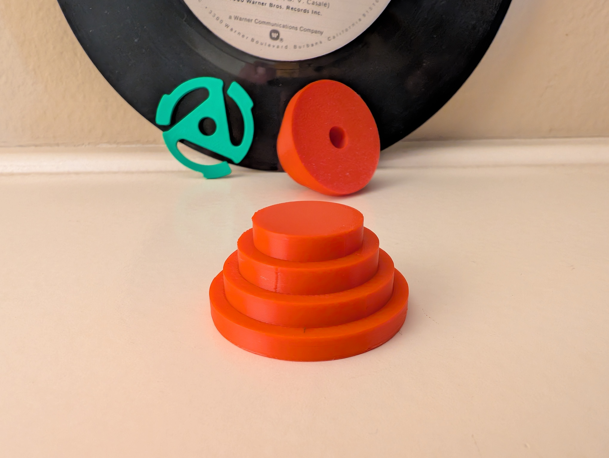
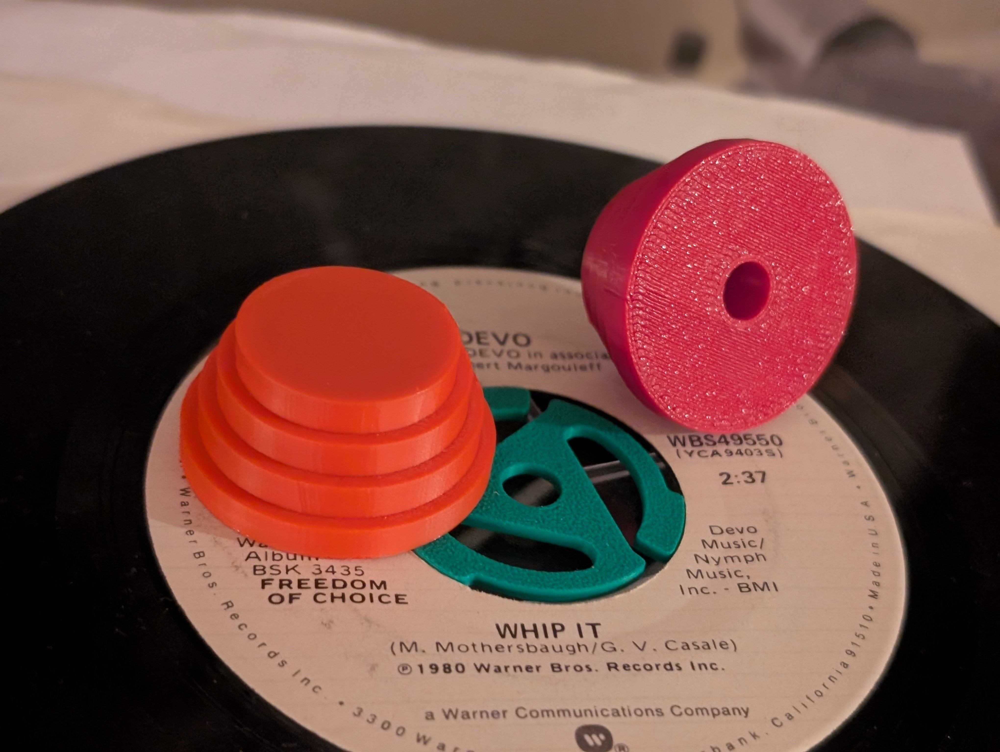
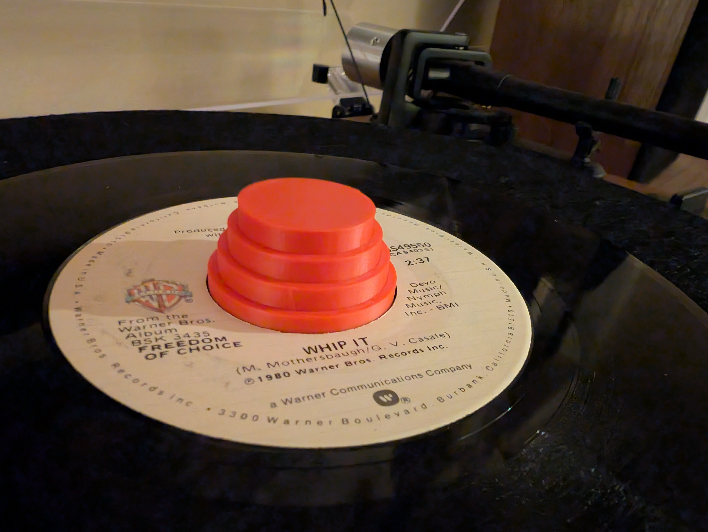

# Devo Energy Dome 45 RPM Record Adapter

A 3D printable 45 RPM record adapter inspired by the iconic red "Energy Dome" hats worn by the new wave band Devo. This adapter allows you to play 45 RPM singles on a standard turntable while paying homage to one of music's most recognizable fashion statements.

## Overview

This project provides files to 3D print a functional 45 RPM record adapter shaped like Devo's famous Energy Dome hat. The adapter is designed to fit standard turntable spindles and properly support 45 RPM singles.

## Repository Structure

- `src/` - Contains the OpenSCAD source file for customization
- `models/` - Contains ready-to-print 3D model files (STL, 3MF)
- `images/` - Contains images and video of the adapter in use
- `docs/` - Additional documentation (if any)

## Files Included

- `src/devo-energy-dome-45-adapter.scad` - OpenSCAD source file for customization
- `models/devo-energy-dome-45-adapter.stl` - STL file ready for slicing and printing
- `models/devo-energy-dome-45-adapter.3mf` - 3MF file for Bambu Studio users
- Image and video files showing the adapter in use

## Technical Specifications

- Base diameter: 38mm (standard 45 adapter size)
- Center hole diameter: 7.5mm (fits standard turntable spindles)
- Total height: 18mm
- Design: 4-step dome structure with 6mm reduction per step
- Resolution: High detail ($fn = 300 in OpenSCAD)

## Printing Recommendations

- Material: PLA or PETG recommended
- Layer height: 0.16mm or lower for smoother steps
- Infill: 20-30% recommended
- Supports: None required
- Print orientation: Flat side down

## Customization

The OpenSCAD file includes parameters that can be modified to adjust:
- Base diameter
- Post hole diameter
- Number of steps in the dome
- Total height
- Reduction in diameter per step

## Usage

1. Print the adapter using your preferred 3D printer
2. Place the adapter on your turntable spindle
3. Place your 45 RPM single on top of the adapter
4. Drop the needle and enjoy your music with style!

## Demo

Check out the included video file to see the adapter in action:
[Action Shot Video](../images/action-shot.mp4)

## About Devo's Energy Dome

The Energy Dome was first worn by Devo in 1980 during their Freedom of Choice tour. Designed by Gerald Casale, it has become an iconic symbol of the band and new wave culture. The band claimed it was designed to "collect energy that escapes from the top of the head" and "recycle it back into the body."

## License

This project is released under the [Creative Commons Attribution 4.0 International License](https://creativecommons.org/licenses/by/4.0/).

This means you are free to:
- **Share** — copy and redistribute the material in any medium or format for any purpose, even commercially.
- **Adapt** — remix, transform, and build upon the material for any purpose, even commercially.

Under the following terms:
- **Attribution** — You must give appropriate credit, provide a link to the license, and indicate if changes were made. You may do so in any reasonable manner, but not in any way that suggests the licensor endorses you or your use.

## Credits

Designed by Jason J. McPheron ([@jmcpheron](https://github.com/jmcpheron))

---

*"We are DEVO!"* 